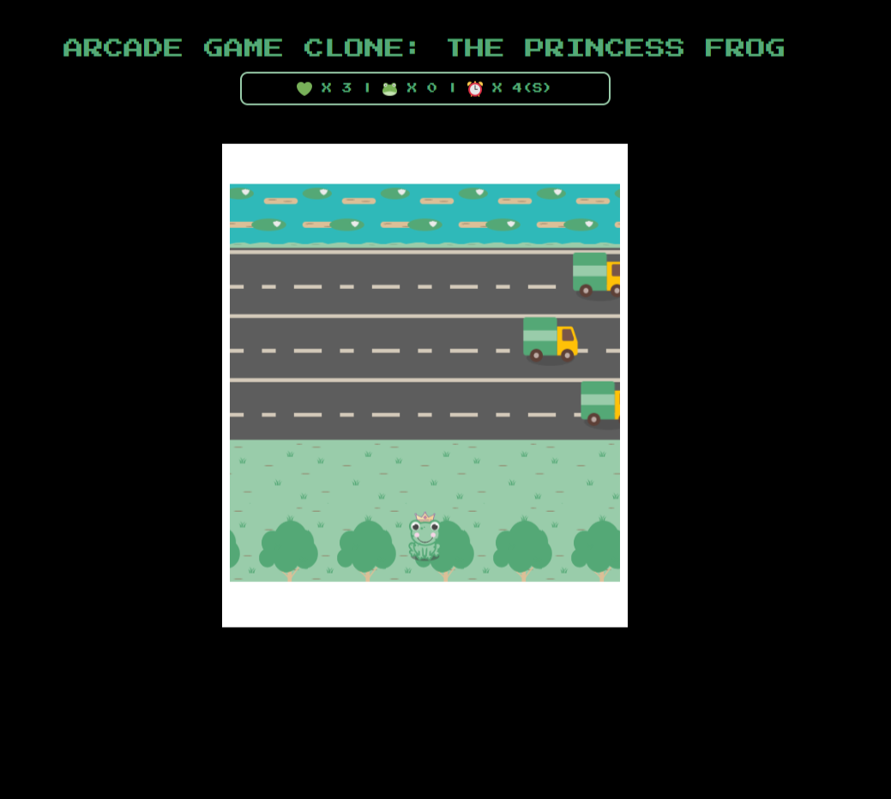
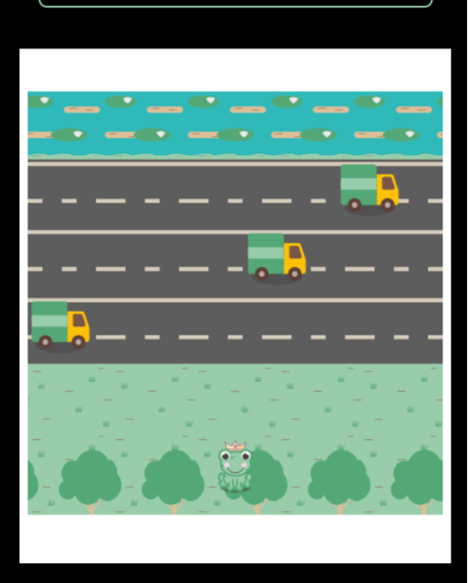
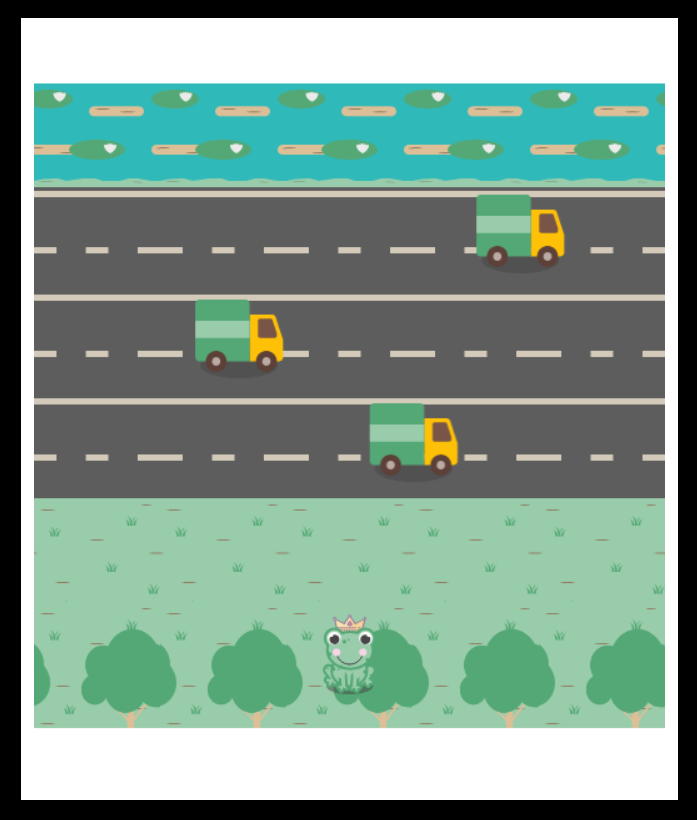
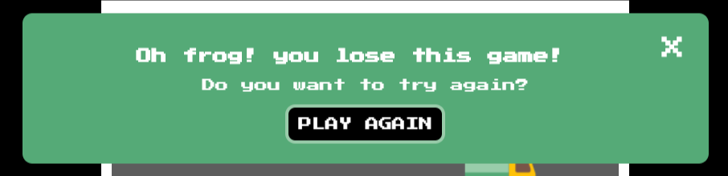
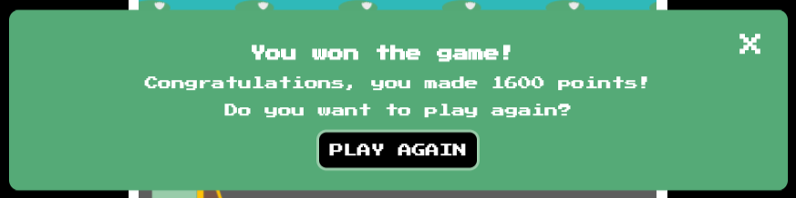
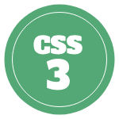

# Arcade Game Clone: The Princess Frog 
This was the fourth project for the Udacity nanodegree, in Front-End Web Developer

# Deployment

Here is the link to view this project live and play the game, please click it below:

<a href="https://cveiga819.github.io/ArcadeGamePrincessFrog/">Arcade Game Clone: The Princess Frog</a>

# Instructions
If you want to download and install the game, and playing locally please follow this steps:

1. click on this buttom and choose, clone or download;

`$ git clone https://github.com/cveiga819/ArcadeGamePrincessFrog.git`

2. and open your game, by clicking in the *index.html* file;

## The goal of the game
### The goal of the game, is score 1600 points, by reaching the water, and avoid hiting by a car, here is the layout.

### In the score-panel you can view the lives you have or lost, the score and the timer 

### when you initiate the game for the first time you can see the instructions

### you can move the player with your keyboards controls, and you need to reach the water (100 points); 
### everytime you hit by a car, you lost a live, and if you didn't reach the 1600 points before the time you lose it too. 

### when you lose the game, a modal box appears

### when you win the game, a modal box appears

## Future Updates 

Although, the game is complete to submit, I have the intention to put other features:
* for user can reach the 1600 points easily, collecting bugs, hearts, and flowers. 
* user can choose which caracter he wants for playing

## Built with 

## Author

Coding - <a href="https://github.com/cveiga819">Catarina Veiga</a>;

Design - <a href="https://github.com/cveiga819">Catarina Veiga</a>;

## Contributing
This code was provided by Udacity, to complete the project in the Front-End Nanodegree. 

## Aknowlegments

I learned many things with this project, and for me it's more easier than the memory game, since I decided to complete this project right before I finished the memory game, so I remembered how I do make things work. Although I'm not complete the game, missing a few details. But I want to add those things a soon as possible.

## License

GNU GENERAL PUBLIC LICENSE Version 3, 29 June 2007